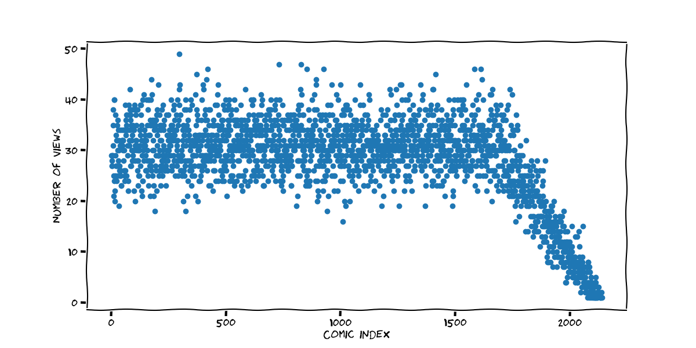

# Why?

To answer the question, as an avid xkcd reader, that uniformly selecting a
random comic will be unfair to the newer comics.

# Goal

This was done with intent to fix/patch the [Easy_xkcd
reader](https://github.com/T-Rex96/Easy_xkcd). 

Ideal solution is to have an equation/function that takes one parameter - where
the bias starts (user editable during run time) and fixes the distribution to
be uniform across all the existing comics. In this code, 1700 is where I set it
at.

# Graph

# Notes

* Approximately #1700 is when I started reading xkcd thoroughly. 
* `READ_COMICS` at 400 per week is a bit of an exaggeration; It's just a guess
  based on my xkcd reading habits
* This is also the first time I've used the xkcd style of graphs in matplotlib
* `TAIL_ITERS` is just to show that the distribution tends to uniform, if the
  comics stop appearing. Set to 1, it has no effect. Increase it to 1000, or
  more to see the graph flattening. (Caution: takes a long time)
* Only requirement is `matplotlib`, `pylint` is optional
